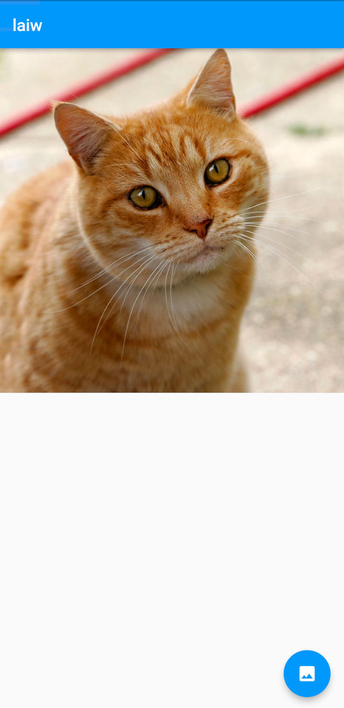

# laiw (locked android image viewer)

Lock an image on the screen.

An idea of [@kusky3](https://github.com/kusky3).

## Installation
Follow this guide to install Flutter on your computer: [Link](https://docs.flutter.dev/get-started/install)

## Features
- Load image from gallery
- Biometric authentication

## Screenshot

## Author
- [@alex27riva](https://www.github.com/alex27riva)